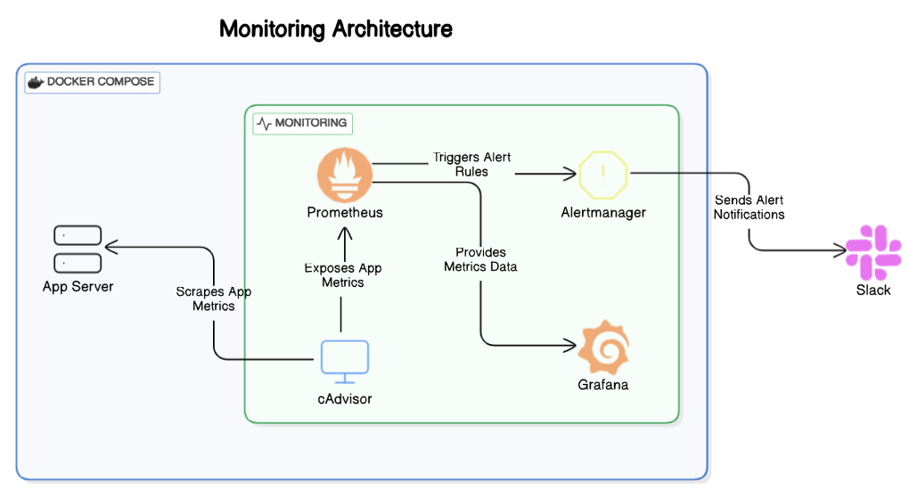
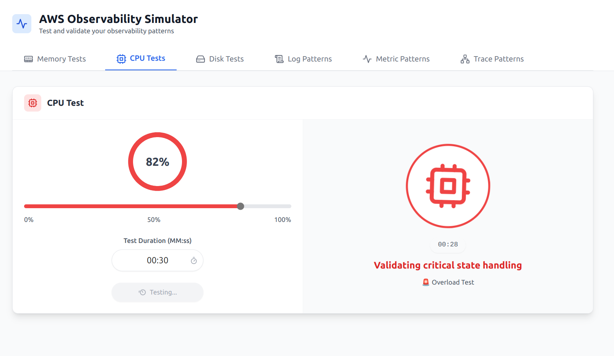
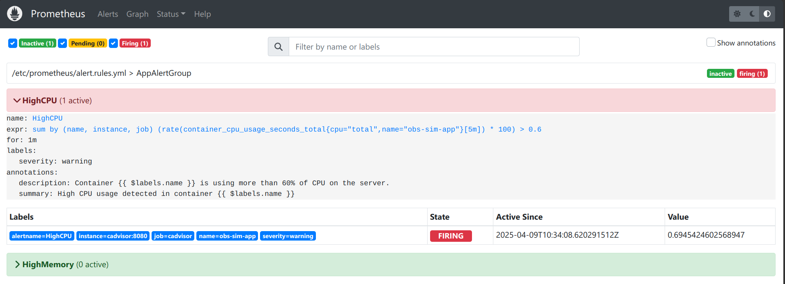
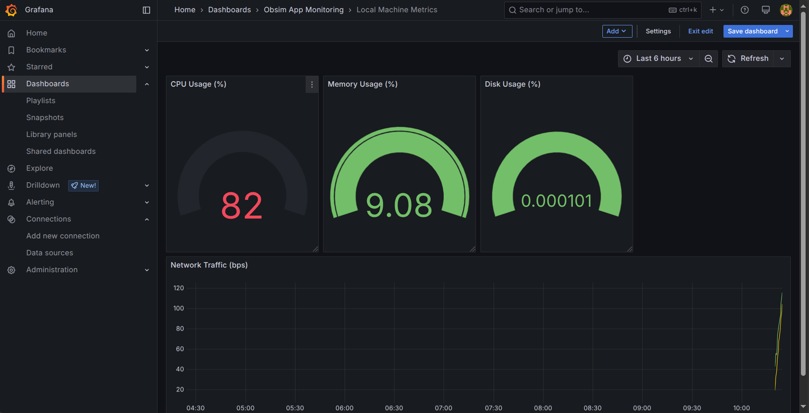

# **Monitoring Setup with Prometheus, Grafana, and Alertmanager**

A containerized application for testing and validating prometheus. This project provides a simulation environment with monitoring, alerting, and visualization capabilities.

## **Overview**

This project uses the following components to monitor and alert system performance:

- **Docker Compose**: Manages and runs all containers.
- **cAdvisor**: Collects container resource usage data (CPU, memory, etc.).
- **Prometheus**: Gathers and stores metrics from services and triggers alerts.
- **Grafana**: Displays metrics through real-time dashboards.
- **Alertmanager**: Sends alerts when issues are detected (like high CPU usage).
- **Slack**: Receives notifications about system issues.

---
<p align="center">  </p>


## Folder structure
├── docker-compose.yml           # Defines and runs all containers
├── prometheus                   # Prometheus configurations
│   ├── alertmanager.yml         # Alertmanager routing and notification settings
│   ├── alert.rules.yml          # Custom alerting rules (e.g., high CPU/memory)
│   └── prometheus.yml           # Prometheus scrape configuration and jobs


## Components
The project consists of several containerized services:

1. **obs-sim-app**: Main application container
   - Port: 5000
   - Resource limits: 
     - CPU: 0.5 cores
     - Memory: 500MB
     - No swap memory

2. **Prometheus**: Metrics collection and storage
   - Port: 9090
   - Configured with custom alert rules
   - Scrapes metrics from all services

3. **Alertmanager**: Alert handling and notifications
   - Port: 9093
   - Integrated with Slack for notifications
   - Configurable alert routing

4. **cAdvisor**: Container metrics collector
   - Port: 8081
   - Monitors container resource usage
   - Provides detailed container metrics

5. **Grafana**: Metrics visualization
   - Port: 3000
   - Default admin password: admin
   - Persistent storage for dashboards and configurations


## Alert Configuration

The system includes pre-configured alerts for:

### High CPU Usage
- Triggers when CPU usage exceeds 60%
- Monitoring interval: 5 minutes
- Alert delay: 1 minute
- Severity: Warning

### High Memory Usage
- Triggers when memory usage exceeds 50%
- Monitoring interval: 1 minute
- Alert delay: 1 minute
- Severity: Warning

## Deployment

### Prerequisites
- Docker and Docker Compose
- Slack webhook URL (for alerts)

### Running the Application

```bash
docker-compose up -d
```

### Accessing Services
- Main Application: http://localhost:5000
- Prometheus: http://localhost:9090
- Alertmanager: http://localhost:9093
- cAdvisor: http://localhost:8081
- Grafana: http://localhost:3000

## Simulation Walkthrough

### Simulating application
- Simluate application to use CPU greater than 60%

<p align="center">  </p>

### Prometheus Alerts
- Prometheus alarms are triggered

<p align="center">  </p>

### Grafana View
- Grafana visulaizes the metrics

<p align="center">  </p>

### Slack Message
- Slack Message received for Alerts
<p align="center">  </p>


## Security Note

Remember to:
- Change default passwords
- Update the Slack webhook URL
- Restrict access to monitoring endpoints
- Review and adjust resource limits as needed